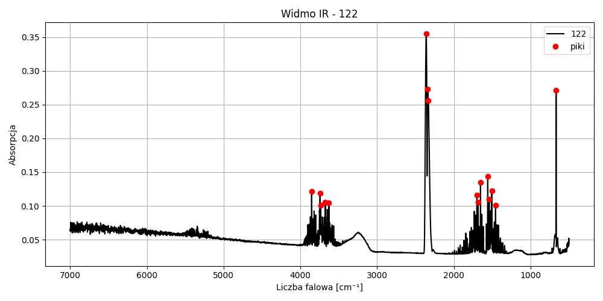
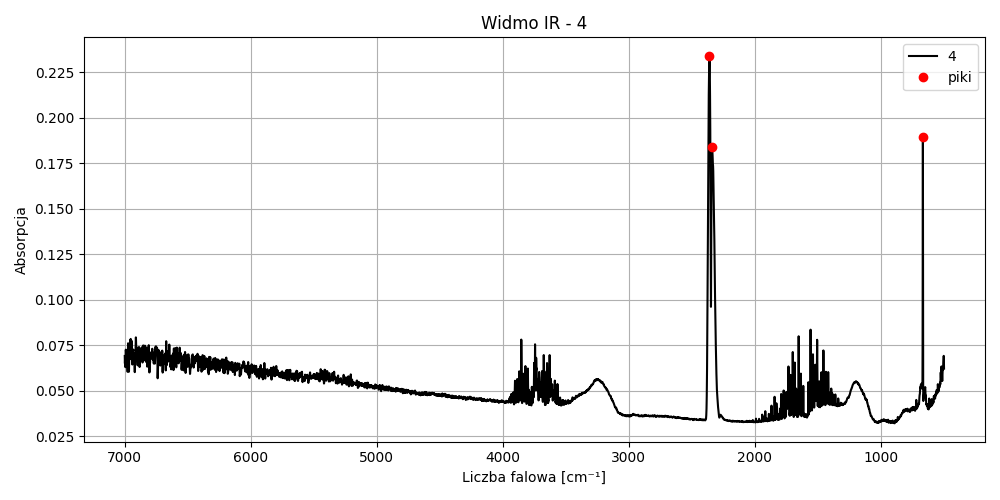

# 📊 Analiza danych IR (podczerwień) – Python

Projekt służy do analizy widm absorpcyjnych uzyskanych z eksperymentu IR (np. FTIR). Skrypt analizuje dane z wielu próbek, wykrywa piki absorpcji, tworzy wykresy oraz eksportuje wyniki.

---

## 🚀 Funkcje

- Wczytywanie danych IR z pliku CSV
- Obsługa do 5 próbek w jednym pliku
- Wizualizacja widm IR (z odwróconą osią X)
- Automatyczne wykrywanie pików absorpcyjnych
- Eksport wykresów do folderu `plots/`
- Eksport danych pików do `results/`

## Przykładowe wykresy






---

## 📁 Struktura projektu

```
ir-analysis/
├── analyze_ir.py            # Główna analiza IR
├── requirements.txt         # Lista zależności
├── README.md                # Opis projektu
├── .gitignore               # Ignorowane pliki i foldery
├── data/                    # Surowe dane wejściowe
│   └── spektrum.csv         # Plik testowy z widmem
├── plots/                   # Zapisane wykresy
└── results/                 # Zapisane dane pików
```

---

## 📥 Format danych wejściowych

Plik CSV z 6 kolumnami:

| Wavenumber (cm⁻¹) | Proba1 | Proba2 | Proba3 | Proba4 | Proba5 |
| ----------------- | ------ | ------ | ------ | ------ | ------ |
| 4000              | 0.01   | ...    | ...    | ...    | ...    |
| 3998              | 0.02   | ...    | ...    | ...    | ...    |
| ...               | ...    | ...    | ...    | ...    | ...    |

---

## ▶️ Jak uruchomić

1. **Zainstaluj zależności**:

```bash
pip install -r requirements.txt
```

2. **Upewnij się, że plik CSV znajduje się w folderze \*\*\*\*\*\*\*\*\*\*\*\*\*\*\*\*\*\*\*\*\*\*\*\*\*\*\*\*\*\*\*\*\*\*\*\*\*\*\*\*\*\*\*\*\*\*\*\*\*\*\*\*\*\*\*\*\*\*\*\*\*\*\*\*\*\*\*\*\*\*\*\*\*\*\*\*\*\*\*\*\*\*\*\***``, np. `data/spektrum.csv`

3. **Uruchom skrypt analizy:**

```bash
python analyze_ir.py
```

W folderze `plots/` znajdziesz wykresy IR dla każdej próbki, a w `results/` — CSV z wykrytymi pikami.

---

## 📦 requirements.txt

```txt
pandas
matplotlib
scipy
```

---

## 📜 Licencja

MIT License — możesz swobodnie korzystać i rozwijać projekt.

---

## 📫 Kontakt

Autor: Michał Kowalewski\
[🌐 ](https://github.com/run4theh111z-stack)[GitHub](https://github.com/run4theh111z-stack)

